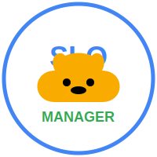

# Corgi SLO Manager

**Version 1.2**  
**Author: Joshua Han**

A modern web application for managing Service Level Objectives (SLOs) with a focus on the definition and governance aspects, not the real-time monitoring.

## Overview

Corgi SLO Manager is a comprehensive tool for defining, tracking, and managing Service Level Objectives (SLOs) across your organization. It helps teams establish reliability targets based on customer experiences, monitor service health, and drive improvements.

## Features

### Team & Service Management
- Create, modify, and delete teams and services
- UID-based reference system to prevent link breakage when names are modified

### Structured UID Management
- Each entity type has its own UID format:
  - SLO UID: `sloUID`
  - SLI UID: `sliUID`
  - CUJ UID: `cujUID`

### Comprehensive Workflow
- Anyone can propose a CUJ (Critical User Journey) for a team's service
- Team owners review proposals and approve/deny with comments
- Approved CUJs can have multiple SLIs (Service Level Indicators)
- Each SLI can have multiple SLOs (Service Level Objectives)
- Full approval workflows for CUJs, SLIs, and SLOs

### Data Management
- Standalone IndexedDB database for local storage
- Database backup and restore functionality
- Audit logging for all modifications and approvals

### Insights
- Dashboard displaying analytics on CUJ, SLI, and SLO creation and approvals per team

## Technology Stack

- **Frontend**: Pure JavaScript with a modular architecture
- **CSS**: Modern CSS with variables, Flexbox/Grid, and animations
- **Storage**: IndexedDB for client-side storage
- **Authentication**: Built-in user management with role-based access control

## Getting Started

### Running the Application

1. Simply open the `index.html` file in a modern web browser.
2. The application will initialize with a default admin user:
   - Email: `admin@example.com`
   - Password: `admin`

### Development

The project is structured as follows:
- `/assets` - Static assets like images and icons
- `/styles` - CSS stylesheets
- `/js` - JavaScript modules
  - `/js/core` - Core functionality (database, auth, router, etc.)
  - `/js/features` - Feature-specific modules
  - `/js/tests` - Unit tests

## Architecture

Corgi SLO Manager follows a modular design pattern with these key components:

1. **Core Modules**:
   - `Database.js` - Handles data storage using IndexedDB
   - `Auth.js` - Manages authentication and authorization
   - `Router.js` - Handles navigation between views
   - `State.js` - Centralized state management with pub/sub
   - `API.js` - Clean interface for data operations
   - `Utils.js` - Utility functions

2. **Feature Modules**:
   - `dashboard.js` - Dashboard and statistics
   - `teams.js` - Team management
   - `services.js` - Service management
   - `cujs.js` - CUJ management
   - `slis.js` - SLI management
   - `slos.js` - SLO management
   - `tools.js` - Tools for database management and audit logs

3. **Main Application**:
   - `app.js` - Initializes and connects all components

## Contributing

Contributions are welcome! Please feel free to submit pull requests or open issues to improve the application.

## License

This project is licensed under the MIT License. 

&copy; 2024 Corgi SLO Manager # corgi-slo-manager
